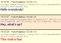

# Lightstreamer - Basic Chat Demo - HTML Client #
<!-- START DESCRIPTION lightstreamer-example-chat-client-javascript -->

This project includes a simple web client front-end example for the [Lightstreamer - Basic Chat Demo - Java Adapter](https://github.com/Weswit/Lightstreamer-example-Chat-adapter-java).

<table>
  <tr>
    <td style="text-align: left">
      &nbsp;<a href="http://demos.lightstreamer.com/ChatDemo" target="_blank"></a>&nbsp;
      
    </td>
    <td>
      &nbsp;An online demonstration is hosted on our servers at:<br>
      &nbsp;<a href="http://demos.lightstreamer.com/ChatDemo" target="_blank">http://demos.lightstreamer.com/ChatDemo</a>
    </td>
  </tr>
</table>

This <b>Basic Chat Demo</b> implements an extremely simple chat application, where all the users connected to the page can exchange messages. Each message reports the originating IP address, together with the user-agent string of the originating client, instead of leveraging a nick name.<br>
Launch multiple instances of the demo, possibly on different machines, to appreciate the message broadcast capability.<br>
The front-end code can be considered a reference example of item subscriptions in DISTINCT mode.<br>

<i>Note: When you publish a value your IP address is publicly displayed.</i><br>

The demo includes the following client-side functionalities:
* A [Subscription](http://www.lightstreamer.com/docs/client_javascript_uni_api/Subscription.html) containing 1 item, subscribed to in <b>DISTINCT</b> mode feeding a [DynaGrid](http://www.lightstreamer.com/docs/client_javascript_uni_api/DynaGrid.html).
* The chat messages are sent to the Lightstreamer Server using the [LightstreamerClient.sendMessage](http://www.lightstreamer.com/docs/client_javascript_uni_api/LightstreamerClient.html#sendMessage) utility.

<!-- END DESCRIPTION lightstreamer-example-chat-client-javascript -->

# Deploy #

Before you can run the demo some dependencies need to be solved:

-  Get the lightstreamer.js file from the [latest Lightstreamer distribution](http://www.lightstreamer.com/download) 
   and put it in the src/js folder of the demo (if that is the case, please create it). Alternatively you can build a lightstreamer.js file from the 
   [online generator](http://www.lightstreamer.com/distros/Lightstreamer_Allegro-Presto-Vivace_5_1_1_Colosseo_20130305/Lightstreamer/DOCS-SDKs/sdk_client_javascript/tools/generator.html).
   In that case be sure to include the LightstreamerClient, Subscription, DynaGrid, and StatusWidget modules and to use the "Use AMD" version.
-  Get the require.js file form [requirejs.org](http://requirejs.org/docs/download.html) and put it in the src/js folder of the demo.

You can deploy this demo in order to use the Lightstreamer server as Web server or in any external Web Server you are running. 
If you choose the former case please note that in the <LS_HOME>/pages/demos/ folder there is a copy of the /src directory of this project, if this is non your case please create the folders <LS_HOME>/pages/demos/ChatDemo then copy here the contents of the /src folder of this project.<br>
The client demo configuration assumes that Lightstreamer Server, Lightstreamer Adapters and this client are launched on the same machine. If you need to targeting a different Lightstreamer server please search this line:
```js
var lsClient = new LightstreamerClient(protocolToUse+"//localhost:8080","CHAT");
```
in js/lsClient.js file and change it accordingly.<br>
Anyway the [CHAT_ROOM](https://github.com/Weswit/Lightstreamer-example-Chat-adapter-java) and [ChatMetadataAdapter](https://github.com/Weswit/Lightstreamer-example-Chat-adapter-java) Adapters have to be deployed in your local Lightstreamer server instance. The factory configuration of Lightstreamer server already provides this adapter deployed.<br>
The demo are now ready to be launched.

# See Also #

## Lightstreamer Adapters needed by this demo client ##
<!-- START RELATED_ENTRIES -->

* [Lightstreamer - Basic Chat Demo - Java Adapter](https://github.com/Weswit/Lightstreamer-example-Chat-adapter-java)
* [Lightstreamer - Reusable Metadata Adapters - Java Adapter](https://github.com/Weswit/Lightstreamer-example-ReusableMetadata-adapter-java)

<!-- END RELATED_ENTRIES -->

## Similar demo clients that may interest you ##

* [Lightstreamer - Basic Messenger Demo - HTML Client](https://github.com/Weswit/Lightstreamer-example-Messenger-client-javascript)

# Lightstreamer Compatibility Notes #

- Compatible with Lightstreamer JavaScript Client library version 6.0 or newer.
