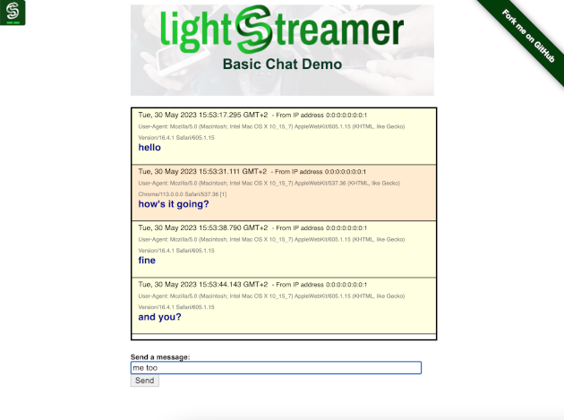

# Lightstreamer - Basic Chat Demo - HTML Client #
<!-- START DESCRIPTION lightstreamer-example-chat-client-javascript -->

The Lightstreamer Basic Chat Demo is a very simple chat application based on Lightstreamer.
This project includes a simple web client front-end example for the [Lightstreamer - Basic Chat Demo - Java Adapter](https://github.com/Weswit/Lightstreamer-example-Chat-adapter-java).

## Live Demo

[](http://demos.lightstreamer.com/ChatDemo)

###[ View live demo](http://demos.lightstreamer.com/ChatDemo)

## Details

This <b>Basic Chat Demo</b> implements an extremely simple chat application, where all the users connected to the page can exchange messages. Each message reports the originating IP address, together with the user-agent string of the originating client, instead of leveraging a nick name.
Launch multiple instances of the demo, possibly on different machines, to appreciate the message broadcast capability.
The front-end code can be considered a reference example of item subscriptions in DISTINCT mode.

*Note: When you publish a value your IP address is publicly displayed.*

The demo includes the following client-side functionalities:
* A [Subscription](http://www.lightstreamer.com/docs/client_javascript_uni_api/Subscription.html) containing 1 item, subscribed to in <b>DISTINCT</b> mode feeding a [DynaGrid](http://www.lightstreamer.com/docs/client_javascript_uni_api/DynaGrid.html).
* The chat messages are sent to the Lightstreamer Server using the [LightstreamerClient.sendMessage](http://www.lightstreamer.com/docs/client_javascript_uni_api/LightstreamerClient.html#sendMessage) utility.

<!-- END DESCRIPTION lightstreamer-example-chat-client-javascript -->

## Install

Note that, as prerequisite, the [Basic Chat Demo - Java Adapter](https://github.com/Weswit/Lightstreamer-example-Chat-adapter-java) has to be deployed on your local Lightstreamer Server instance. Please check out that project and follow the installation instructions provided with it.

* Clone this project.
* Get the `lightstreamer.js` file from the [latest Lightstreamer distribution](http://www.lightstreamer.com/download) 
   and put it in the `src/js` folder. Alternatively you can build a `lightstreamer.js` file from the 
   [online generator](http://www.lightstreamer.com/distros/Lightstreamer_Allegro-Presto-Vivace_5_1_1_Colosseo_20130305/Lightstreamer/DOCS-SDKs/sdk_client_javascript/tools/generator.html).
   In that case be sure to include the LightstreamerClient, Subscription, DynaGrid, and StatusWidget modules and to use the "Use AMD" version.
*  Get the `require.js` file form [requirejs.org](http://requirejs.org/docs/download.html) and put it in the `src/js` folder.
* Deploy this demo on the Lightstreamer server (used as Web server) or in any external Web Server. If you choose the former, please note that in the `<LS_HOME>/pages/demos/` folder there may be already a `ChatDemo` folder, copy of the `/src` directory of this project, if this is not your case please create the folders `<LS_HOME>/pages/demos/ChatDemo` and copy here the contents of the `/src` folder of this project.
The client demo configuration assumes that Lightstreamer Server, Lightstreamer Adapters and this client are launched on the same machine. If you need to targeting a different Lightstreamer server please search this line:
```js
var lsClient = new LightstreamerClient(protocolToUse+"//localhost:"+portToUse,"CHAT");
```
in js/lsClient.js file and change it accordingly.<br>
* Open your browser and point it to: [http://localhost:8080/demos/ChatDemo/](http://localhost:8080/demos/ChatDemo/)

## See Also

### Lightstreamer Adapters Needed by This Client
<!-- START RELATED_ENTRIES -->

* [Lightstreamer - Basic Chat Demo - Java Adapter](https://github.com/Weswit/Lightstreamer-example-Chat-adapter-java)
* [Lightstreamer - Reusable Metadata Adapters - Java Adapter](https://github.com/Weswit/Lightstreamer-example-ReusableMetadata-adapter-java)

<!-- END RELATED_ENTRIES -->

### Related Projects

* [Lightstreamer - Basic Messenger Demo - HTML Client](https://github.com/Weswit/Lightstreamer-example-Messenger-client-javascript)

## Lightstreamer Compatibility Notes

- Compatible with Lightstreamer JavaScript Client library version 6.0 or newer.
